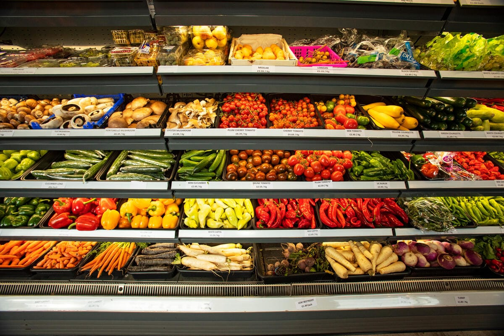
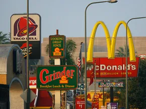

<br>
```{r echo=FALSE}
knitr::opts_chunk$set(message = FALSE, warning = FALSE)
library(vembedr)
```


## **Welcome!**

Food access is a cornerstone of health and well-being, yet for many, it remains a significant challenge. Our project explores food deserts in New York City and investigates how limited access to nutritious and affordable food affects health and exacerbates social inequalities. By combining localized mapping of New York City with a broader statewide analysis, we aim to provide meaningful insights into food access disparities and their far-reaching consequences.

Join us as we delve into the data, share our findings, and explore actionable solutions for promoting equitable food access and better health outcomes for all.

{width=60%}

Source:[Food Forward NDCs](https://foodforwardndcs.panda.org/food-environment/improving-physical-and-economic-access-to-healthy-and-sustainable-foods/)

## **Background Information**

Access to healthy and affordable food is essential for maintaining a balanced diet and preventing chronic diseases such as obesity, Type II diabetes, etc. However, systemic barriers often limit this access for many, particularly in low-income communities. These areas, known as food deserts, lack adequate grocery stores or markets that provide fresh produce and other nutritious options.

{width=60%}

Source: [HowStuffWorks](https://science.howstuffworks.com/environmental/green-science/food-desert.htm)

New York State is home to over 19.6 million people, yet stark disparities exist in food access across its boroughs and neighborhoods. Factors such as population density, socioeconomic status, and proximity to retail stores play critical roles in shaping food availability.

This project focuses on mapping and analyzing food deserts in NYC at the census tract level while contextualizing NYC-specific trends by providing a broader perspective on food access within New York State level. By doing so, we aim to address the following:

-Identifying underserved areas and the severity of food insecurity.

-Understanding the socioeconomic and health implications of limited food access.

-Exploring trends in food distribution over state and their broader implications for policy and interventions.


Through rigorous data analysis and visualization, we hope to contribute to a deeper understanding of food deserts and the systemic inequities they reflect, fostering pathways toward healthier, more equitable communities.

## **Data Source**
NYC 2020 Census Tract Dataset from [NYC Open Data](https://data.cityofnewyork.us/City-Government/2020-Census-Tracts/63ge-mke6/about_data)

NYC 2020 Decennial Census Data from [2020 Census - DCP](https://www.nyc.gov/site/planning/planning-level/nyc-population/2020-census.page) 

Retail Store Dataset from [Open Data NY](https://data.ny.gov/Economic-Development/Retail-Food-Stores/9a8c-vfzj/about_data)

Behavioral Risk Factor Surveillance System 2022 Dataset from [BRSFF 2022](https://health.data.ny.gov/Health/Behavioral-Risk-Factor-Surveillance-Survey-2022/2nna-hj5u/about_data)

## **Report**

Explore our [report](report.html) to see detailed project description.

## **About Our Team**
### Team Members
Tianqi Li(tl3279)

Sihan Qiu(sq2266)

Kehan Su(ks4186)

Xinyu Wang(xw2961)

Enju Zhang(ez2384)

### Github Repository
The repository of this project can be found [here](https://github.com/tl3279/final.github.io).

## **Screencast**
```{r echo=FALSE}
embed_url("https://www.youtube.com/watch?v=rZgZswohWzU")
```


